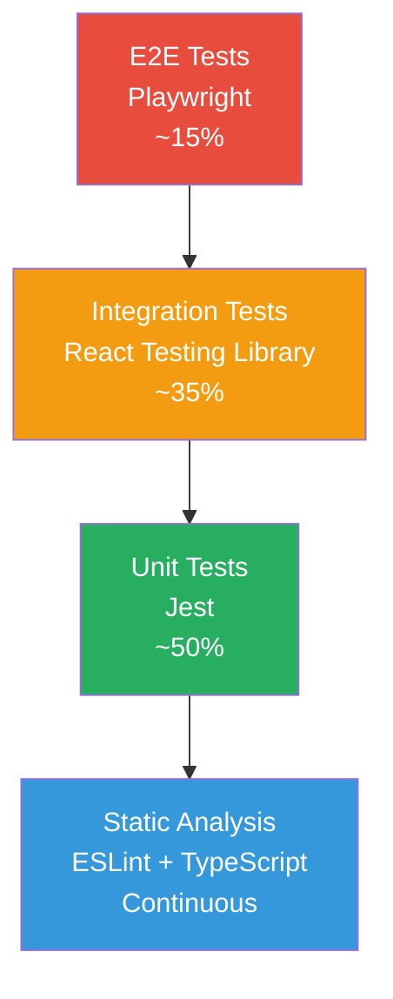
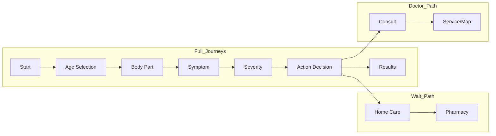

# WEEtell Testing Strategy

## Overview

This document defines the testing strategy for the WEEtell web application - a pediatric health symptom navigation tool with icon-based, sound-driven interface.

## Project Context

- **Framework**: Next.js 16 with React 19
- **Language**: TypeScript
- **State Management**: Zustand with persist middleware
- **Testing Tools**: Jest + Testing Library (unit/integration), Playwright (E2E)
- **Styling**: Tailwind CSS
- **Audio**: Web Speech API (speechSynthesis), Web Audio API (AudioContext)

---

## Testing Pyramid



### Test Distribution

| Layer | Tool | Percentage | Purpose |
|-------|------|------------|---------|
| Unit | Jest | 50% | Store logic, utilities, pure functions |
| Integration | React Testing Library | 35% | Component behavior, user interactions |
| E2E | Playwright | 15% | Critical user journeys, cross-browser |

---

## Test Types Strategy

### 1. Unit Tests

**Focus Areas:**
- [`useAssessmentStore.ts`](src/stores/useAssessmentStore.ts) - State management logic
- [`audio.ts`](src/lib/audio.ts) - Audio manager class methods
- Data transformation functions in [`symptom-graph.tsx`](src/data/symptom-graph.tsx)

**Naming Convention:** `*.test.ts` or `*.spec.ts`

**Example Test Structure:**
```typescript
// src/lib/__tests__/audio.test.ts
describe('AudioManager', () => {
  describe('narrate', () => {
    it('should call speechSynthesis.speak with correct locale', () => {})
    it('should not speak when disabled', () => {})
  })
})
```

### 2. Component Tests (Integration)

**Focus Areas:**
- Selection components: [`AgeSelection.tsx`](src/components/organisms/AgeSelection.tsx), [`BodyMapSelection.tsx`](src/components/organisms/BodyMapSelection.tsx)
- Interactive elements: [`InteractiveCard.tsx`](src/components/atoms/InteractiveCard.tsx)
- Video player: [`VideoPlayer.tsx`](src/components/molecules/VideoPlayer.tsx)

**Testing Approach:**
- Test user interactions and state changes
- Verify accessibility (ARIA attributes, keyboard navigation)
- Test with RTL queries: `getByRole`, `getByLabelText`, `findByText`

**Example:**
```typescript
// src/components/organisms/__tests__/AgeSelection.test.tsx
import { render, screen, fireEvent } from '@testing-library/react'
import { AgeSelection } from '../AgeSelection'

describe('AgeSelection', () => {
  it('allows selecting baby age group', async () => {
    const onSelect = vi.fn()
    render(<AgeSelection onSelect={onSelect} />)
    
    await fireEvent.click(screen.getByRole('button', { name: /baby/i }))
    expect(onSelect).toHaveBeenCalledWith('baby')
  })
})
```

### 3. E2E Tests (Playwright)

**Critical User Journeys:**



**Test Files Location:** `e2e/**/*.spec.ts`

**Required Test Scenarios:**

| Priority | Journey | Description |
|----------|---------|-------------|
| P0 | Complete fever assessment | Full flow: age → body → symptom → severity → action |
| P0 | Wait pathway | Verify home care content displays correctly |
| P0 | Doctor pathway | Verify urgency levels and consult page |
| P1 | Language switching | Test EN → DE → ES → TR transitions |
| P1 | Accessibility toggle | Test text labels and subtitles toggles |
| P1 | Back navigation | Verify state preservation when going back |
| P2 | Video playback | Test video loads and controls work |
| P2 | Audio feedback | Verify sound plays on interactions |
| P2 | Responsive design | Test mobile, tablet, desktop layouts |

---

## Accessibility Testing Strategy

Per WCAG 2.1 AA requirements from specification:

### Automated Testing

- **axe-core**: Include in E2E tests
- **eslint-plugin-jsx-a11y**: Static analysis
- **playwright-accessibility**: Automated audits

### Manual Testing Checklist

| Requirement | Test Method |
|-------------|-------------|
| Screen reader compatibility | VoiceOver/NVDA testing |
| Keyboard navigation | Tab through all interactive elements |
| Touch targets ≥44px | Measure interactive element sizes |
| Contrast ratio 4.5:1 | Use browser dev tools |
| Subtitle display | Toggle subtitles, verify visibility |
| Text labels toggle | Test show/hide functionality |

### Test Locations

- Component tests: Verify ARIA attributes
- E2E tests: Full keyboard navigation flows

---

## Test Organization

### Directory Structure

```
src/
├── __tests__/                    # Unit tests (co-located preference)
│   ├── stores/
│   │   └── useAssessmentStore.test.ts
│   └── lib/
│       └── audio.test.ts
├── components/
│   ├── atoms/
│   │   └── __tests__/
│   │       └── InteractiveCard.test.tsx
│   ├── molecules/
│   │   └── __tests__/
│   │       └── VideoPlayer.test.tsx
│   └── organisms/
│       └── __tests__/
│           └── AgeSelection.test.tsx
└── app/
    └── __tests__/
        └── page.test.tsx

e2e/
├── assessment-flow.spec.ts
├── accessibility.spec.ts
├── language-switching.spec.ts
└── video-playback.spec.ts
```

### Naming Conventions

| Type | Pattern | Example |
|------|---------|---------|
| Unit | `{module}.test.ts` | `audio.test.ts` |
| Component | `{Component}.test.tsx` | `AgeSelection.test.tsx` |
| E2E | `{feature}.spec.ts` | `assessment-flow.spec.ts` |

---

## CI/CD Integration

### GitHub Actions Workflow

```yaml
# .github/workflows/test.yml
name: Tests

on: [push, pull_request]

jobs:
  unit:
    runs-on: ubuntu-latest
    steps:
      - uses: actions/checkout@v4
      - uses: actions/setup-node@v4
        with:
          node-version: '20'
      - run: npm ci
      - run: npm run test:coverage
      - uses: codecov/codecov-action@v4

  e2e:
    runs-on: ubuntu-latest
    steps:
      - uses: actions/checkout@v4
      - uses: actions/setup-node@v4
        with:
          node-version: '20'
      - run: npm ci
      - run: npx playwright install --with-deps
      - run: npm run test:e2e
```

### Running Tests

| Command | Description |
|---------|-------------|
| `npm test` | Run Jest unit/integration tests |
| `npm run test:watch` | Run tests in watch mode |
| `npm run test:coverage` | Generate coverage report |
| `npm run test:e2e` | Run Playwright E2E tests |
| `npm run test:e2e:ui` | Run E2E with UI |
| `npm run test:all` | Run all tests |

---

## Coverage Targets

| Layer | Target | Critical Files |
|-------|--------|-----------------|
| Statements | 70% | All |
| Branches | 65% | Store logic |
| Functions | 70% | Utilities |
| Lines | 70% | All |

### Priority Coverage

1. **Must Have (100%)**
   - [`useAssessmentStore.ts`](src/stores/useAssessmentStore.ts) - All actions and selectors
   - [`audio.ts`](src/lib/audio.ts) - All playback methods

2. **Should Have (80%)**
   - All selection components
   - Navigation components

3. **Nice to Have (60%)**
   - Display-only components
   - Static pages

---

## Mock Strategy

Existing mocks in [`jest.setup.js`](jest.setup.js) cover:

- `window.AudioContext` - Audio playback
- `window.speechSynthesis` - Text-to-speech
- `window.matchMedia` - Media queries
- `window.localStorage` - Persistence

### Additional Mocks Required

```typescript
// jest.setup.js additions needed:

// Mock Next.js router
jest.mock('next/navigation', () => ({
  useRouter: () => ({
    push: jest.fn(),
    back: jest.fn(),
  }),
  usePathname: () => '/',
}))

// Mock next/image
jest.mock('next/image', () => ({
  __esModule: true,
  default: (props) => ,
}))

// Mock framer-motion
jest.mock('framer-motion', () => ({
  motion: {
    div: 'div',
    button: 'button',
  },
  AnimatePresence: ({ children }) => children,
  useAnimation: () => ({
    start: jest.fn(),
  }),
}))
```

---

## Implementation Roadmap

### Phase 1: Foundation
- [ ] Add missing Jest mocks (Next.js router, framer-motion)
- [ ] Create first unit tests for store
- [ ] Configure Jest coverage thresholds

### Phase 2: Component Tests
- [ ] Test all selection components
- [ ] Test accessibility features (toggles)
- [ ] Achieve 70% line coverage

### Phase 3: E2E Tests
- [ ] Configure Playwright browsers
- [ ] Write critical path tests
- [ ] Add accessibility audit tests

### Phase 4: CI Integration
- [ ] Add GitHub Actions workflow
- [ ] Configure codecov reporting
- [ ] Set up branch protection rules

---

## Key Testing Principles

1. **Test Behavior, Not Implementation** - Focus on user-facing behavior
2. **Co-locate Tests** - Keep tests near the code they test
3. **Meaningful Descriptions** - Test names should describe what they verify
4. **AAA Pattern** - Arrange, Act, Assert
5. **One Concern Per Test** - Each test should verify one behavior

---

## References

- [Jest Documentation](https://jestjs.io/)
- [React Testing Library](https://testing-library.com/docs/react-testing-library/intro/)
- [Playwright](https://playwright.dev/)
- [WCAG 2.1 Guidelines](https://www.w3.org/WAI/WCAG21/quickref/)
- [axe-core](https://www.deque.com/axe/)